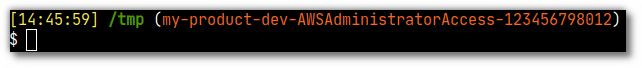

`aw` is a script that sets `AWS_PROFILE` based on the contents in `~/.aws/config`, and possibly logs in with AWS SSO using the selected profile.

Example:

```sh
$ echo $AWS_PROFILE


```

yields an empty result. If you run:

```shell
$ . aw
```


then `AWS_PROFILE` is set:

```shell
$ echo $AWS_PROFILE
okctl-dev-AWSAdministratorAccess-123456789012
````

:bulb: If you add the `-l` flag (`. aw -l`), you will be logged in with AWS SSO as well (same as running `aws sso login`).

And even better, if you follow the instructions (see installation steps below) to add `AWS_PROFILE` to your shell prompt, you will always know which AWS environment you're operating in. Example:



# Installation

## Requirements

### Install fzf

* For Bash or Zsh: https://github.com/junegunn/fzf

* For Fish: https://github.com/PatrickF1/fzf.fish

### Configure one or more AWS profiles

If you haven't done this already, you need to run

`aws sso configure` (if you're using SSO)

This should produce the file `~/.aws/config`, which is needed by `aw`.

## Bash or Zsh

* Run

```sh
cd folder-where-i-like-to-put-git-repos
git clone https://github.com/oslokommune/km-helpscripts.git
```

* Add `folder-where-i-like-to-put-git-repos/aws/aws-profile-setter` to your PATH ([how to add stuff to your PATH](https://unix.stackexchange.com/questions/117467/how-to-permanently-set-environmental-variables)).
* Verify by running `aw`, it should not produce an error

* Add `AWS_PROFILE` to the shell prompt by adding

```
 \$(__aws_profile_ps1)
```

to your PS1 environment variable. It may be found in your ~/.bashrc file.

Example of a full PS1:

```bash
PS1="\[\033[01;36m\]\w\[\033[01;34m\]\$(__git_ps1)\[\e[0m\] \$(__aws_profile_ps1)$ "
```

## Zsh


* Run

```sh
cd folder-where-i-like-to-put-git-repos
git clone https://github.com/oslokommune/km-helpscripts.git
```

* Add `folder-where-i-like-to-put-git-repos/aws/aws-profile-setter` to your PATH ([how to add stuff to your PATH](https://unix.stackexchange.com/questions/117467/how-to-permanently-set-environmental-variables)).
* Verify by running `aw`, it should not produce an error

* Add `AWS_PROFILE` to the shell prompt by doing the following steps:

  * Add this function to `~/.zshrc`


```zsh
 function echo_aws_profile() {
    __aws_profile_ps1
}
```

  * Add `$(echo_aws_profile)` to your PROMPT variable

Example of how a `~/.zshrc` can look:

```zsh
function echo_aws_profile() {
    __aws_profile_ps1
}

setopt promptsubst
PROMPT="%(?:%{$fg_bold[green]%}➜ :%{$fg_bold[red]%}➜ )"
PROMPT+=' %{$fg[cyan]%}%c%{$reset_color%} $(git_prompt_info)$(echo_aws_profile)'
```

## Fish

* Run

```sh
cd folder-where-i-like-to-put-git-repos
git clone https://github.com/oslokommune/km-helpscripts.git
```

* Add `folder-where-i-like-to-put-git-repos/aws/aws-profile-setter` to your PATH ([how to add stuff to your PATH](https://unix.stackexchange.com/questions/117467/how-to-permanently-set-environmental-variables)).
* Verify by running `aw`, it should not produce an error

* Run

```
fisher install edc/bass
alias fs="bass source"
funcsave fs
```

* Verify by running `fs aw` , it should not produce an error

We need this to be able to source bash commands (see usage examples below).

* Add `AWS_PROFILE`  to the shell prompt by adding

```fish
    if set -q AWS_PROFILE
        set_color $fish_color_norma
        printf "("

        set_color fb6620
        printf "$AWS_PROFILE"

        set_color $fish_color_normal
        printf ")"
    end
```

to the end of your `~/.config/fish/functions/fish_prompt.fish`.

See example in [fish_prompt.fish](fish/fish_prompt.fish).


# Usage examples

## Bash or Zsh

### Set AWS_PROFILE

```shell
. aw

echo $AWS_PROFILE
```

### Set AWS_PROFILE and login at the same time

The `-l`  flag makes `aw` run  `aws sso login` for you.

```shell
. aw -l

echo $AWS_PROFILE
```

## Fish

### Set AWS_PROFILE

```shell
fs aw

echo $AWS_PROFILE
```

### Set AWS_PROFILE and login at the same time

The `-l`  flag makes `aw` run  `aws sso login` for you.

```chrshell
fs aw -l

echo $AWS_PROFILE
```
